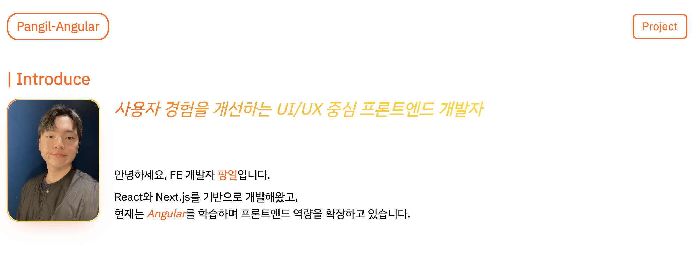

# pangil portfolio (angular)

<p align="center">
  
</p>

<p align="center">
  Angular로 구축한 개인 포트폴리오 웹사이트입니다.<br />
  프로젝트/경험/기술 스택을 데이터 중심 구조로 관리하며, 운영 중인 서비스 중심으로 소개합니다.
</p>

<p align="center">
  <a href="https://pangil-portfolio-angular.vercel.app" target="_blank">Live Demo</a>
  ·
  <a href="./src/app/pages/home/index.ts">Home Source</a>
  ·
  <a href="./src/app/pages/project/index.ts">Project Source</a>
</p>

## Tech Stack

<p>
  
  
  
</p>
<p>
  
  
</p>
<p>
  
  
</p>

## Why Angular?

React/Next.js 기반으로 개발해오던 중,
프레임워크 중심 구조와 강한 규칙성을 가진 Angular를 학습하고자 본 프로젝트를 시작했습니다.

특히 아래와 같은 차이를 경험하는 것을 목표로 했습니다.

- 컴포넌트 + DI 기반 구조 이해
- Angular Router 기반 페이지 설계
- 상태 관리 없이도 구조적으로 확장 가능한 설계 방식
- 템플릿 기반 렌더링과 TypeScript 활용 방식 비교

## Key Decisions

### 1. 데이터 중심 구조

UI에 직접 데이터를 하드코딩하지 않고,
`constants` 파일을 통해 콘텐츠를 관리하도록 설계했습니다.

→ 유지보수성과 확장성을 고려한 구조

### 2. 페이지 위계 분리

- Home: 핵심 요약
- Project: 상세 설명

→ 사용자 탐색 흐름을 고려한 정보 구조 설계

### 3. 공통 레이아웃 구성

Header / Footer를 분리하여
모든 페이지에서 재사용 가능한 구조로 설계했습니다.

## What I Learned

- Angular의 컴포넌트 기반 구조와 DI 패턴 이해
- React와 Angular의 렌더링 및 구조 차이 체감
- Router 기반 페이지 설계 방식 학습
- NgOptimizedImage를 활용한 이미지 최적화 경험

## Features

- 데이터 중심 렌더링: `constants` 기반으로 콘텐츠를 일관되게 관리
- 페이지 분리: Home(요약) / Project(상세) 정보 위계 설계
- 반응형 UI: 모바일 우선으로 구성 후 데스크톱 확장
- 공통 레이아웃: Header/Footer 재사용 구조
- 운영 프로젝트 중심 포트폴리오 구성

## Project Structure

```txt
src/
  app/
    app.routes.ts
    constants/
      tech-skills.ts
      projects.ts
      experience.ts
    pages/
      home/index.ts
      project/index.ts
    shared/
      layout/
        main-layout.ts
        header.ts
        footer.ts
      ui/
        button.ts
  styles.css
public/
  images/
    banner.png
    profile.jpeg
```

## Getting Started

```bash
npm install
npm start
```

build:

```bash
npm run build
```

test:

```bash
npm run test -- --watch=false
```

## Deployment

- Hosting: Vercel
- CI/CD: GitHub Actions (`.github/workflows/vercel-ci-cd.yml`)
- `main` 브랜치 푸시 시 CI 통과 후 프로덕션 배포

## Content Source

포트폴리오 콘텐츠는 아래 상수 파일을 기준으로 관리합니다.

- `src/app/constants/tech-skills.ts`
- `src/app/constants/projects.ts`
- `src/app/constants/experience.ts`

## Commit Convention

Conventional Commits를 사용합니다.

- `feat: ...`
- `fix: ...`
- `refactor: ...`
- `style: ...`
- `chore: ...`
